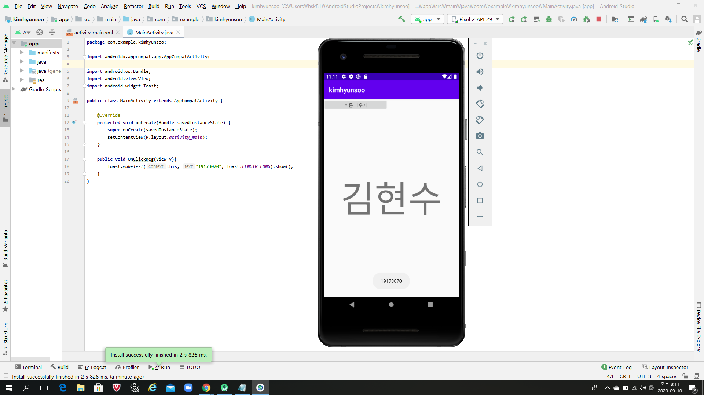

# 19173070 김현수

## 2주차 과제
</img>
## 3주차 과제
</img>
</img>
</img>
## 4주차 과제
- 내 손안에 냉장고앱
  냉장고 속에 있는 식재료들을 어플에 등록하면 냉장고 속에 있는 식재료들로 만들 수 있는 레시피를 추천해주는 앱이다.
  기존 요리백과-만개의 레시피 앱을 참고하였고, 요리백과 앱과 다르게 냉장고 속 안에 있는 재료를 활용하여 요리를 할 수 있게 도와주는 앱이며, 요리 초보자들을 위해 불 조절 알림 기능, 속도   기능 등을 추가하여 요리를 더욱 쉽게 따라할 수 있는 앱을 구상해보았다.
 
  ▶레시피 추천
  냉장고 속 식재료들을 등록하여 냉장고 안에 있는 식재료로 만들 수 있는 레시피를 추천한다. 
  냉장고 속에 없는 식재료를 몇 가지 추가하여 만들 수 있는 레시피를 추천한다. 
  한식, 양식, 중식, 디저트, 도시락, 음료수 등 테마별 레시피를 추천한다.
 
  ▶요리 과정
  동영상과 사진 설명이 되어 있어 손 쉽게 따라할 수 있다.
  요리 시작 버튼을 누르면 동영상이나 사진을 동시에 보면서 타이머 기능과 불 조절 알림 기능 추가, 속도(빠름, 중간, 느림)를 설정할 수 있는 기능이 추가되어 있어서 때에 맞게 설정하여 요리를   할 수 있다.

  ▶냉장고 안 레시피
  냉장고 속 식재료들을 촬영하여 올리면 어플 사용자들이 기존에 없던 새로운 레시피를 공유한다.

  ▶후기
  앱에 있는 레시피를 활용하여 만든 음식을 촬영하여 사람들과 공유할 수 있다.
  
 
## 7주차 과제
</img>
</img>
